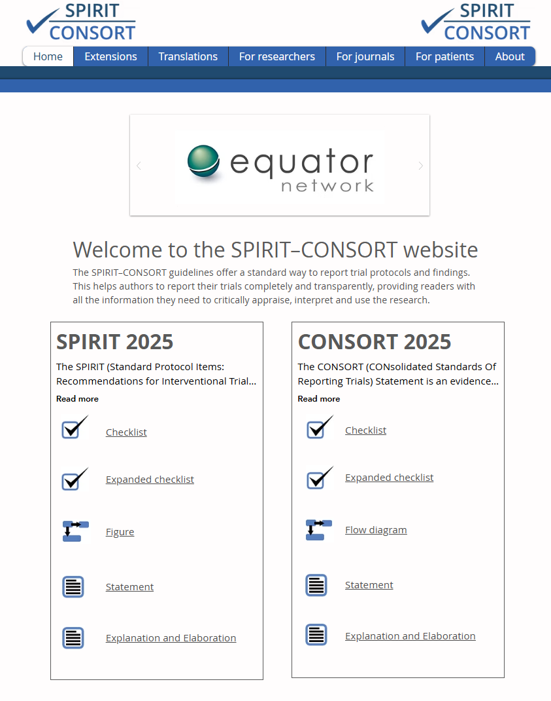

#  {.plain}
\center
```{r, echo = FALSE, out.width = "20%", fig.align = "center"}
knitr::include_graphics("1-Abbildungen/ivf-1-otto.png")
```
\vspace{2mm}

\huge
Interventionsforschung
\vspace{4mm}

\large
MSc Klinische Psychologie und Psychotherapie

MSc Umweltpsychologie / Mensch-Technik-Interaktion

\vspace{2mm}
SoSe 2026

\vspace{2mm}
\normalsize
Prof. Dr. Dirk Ostwald

#  {.plain}
\vfill
\center
\huge
\textcolor{black}{(1) Interventionsforschung}
\vfill

#
\footnotesize

**Approbationsordnung für Psychotherapeutinnen und Psychotherapeuten (2020) Anlage 2 (zu § 8 Nummer 2)**

Inhalte, die im Masterstudiengang im Rahmen der
hochschulischen Lehre zu vermitteln und bei dem Antrag auf Zulassung zur
psychotherapeutischen Prüfung nachzuweisen sind.

*Vertiefte Forschungsmethodik*

Die studierenden Personen

(a) wenden komplexe und multivariate Erhebungs- und Auswertungsmethoden zur
Evaluierung und Qualitätssicherung von Interventionen an,
(b) nutzen und beurteilen einschlägige Forschungsstudien und deren Ergebnisse
für die Psychotherapie
(c) planen selbständig Studien zur Neu- oder Weiterentwicklung der Psychotherapieforschung
oder der Forschung in angrenzenden Bereichen, führen solche Studien durch,
werten sie aus und fassen sie zusammen,
(d) bewerten wissenschaftliche Befunde sowie Neu- oder Weiterentwicklungen in
der Psychotherapie inhaltlich und methodisch in Bezug auf deren Forschungsansatz
und deren Aussagekraft, sodass sie daraus fundierte Handlungsentscheidungen
für die psychotherapeutische Diagnostik, für psychotherapeutische Interventionen
und für die Beratung ableiten können.

Zur Vermittlung der Inhalte der vertieften Forschungsmethodik sind bei der Planung
der hochschulischen Lehre mindestens 6 ECTS-Punkte vorzusehen und die folgenden
Wissensbereiche abzudecken:

(a) multivariate Verfahren und Messtheorie,
(b) Evaluierung wissenschaftlicher Befunde und deren Integration in die eigene psychotherapeutische Tätigkeit.

#
\footnotesize

**MSc Umweltpsychologie / Mensch-Technik-Interaktion**

Der Studiengang vermittelt fundierte fachliche Kenntnisse sowie **methodische und
analytische Fähigkeiten**, die eine kritische Einordnung wissenschaftlicher Erkenntnisse
und verantwortungsvolles Handeln in inter- und transdisziplinären Kontexten ermöglichen.
Eine breite, **kompetenzorientierte Methodenausbildung** bildet dabei das Rückgrat des Studiums.
Inhaltlich zielt der Master darauf ab, das Potenzial der Psychologie gezielt zur
Unterstützung der beschriebenen gesellschaftlichen Transformationsprozesse zu aktivieren.

Vor diesem Hintergrund stützt sich der Studiengang auf drei Säulen: die
klassische Umweltpsychologie, die Transformationspsychologie sowie die Psychologie der
Mensch-Technik-Interaktion. Die Integration dieser drei Säulen stellt ein
deutschlandweites Alleinstellungsmerkmal dar. Im Rahmen der Methodenausbildung
erwerben die Studierenden vertiefte Kenntnisse in den Bereichen **Forschungsmethoden,
Evaluationsforschung und Diagnostik**.

Darüber hinaus setzen sie sich mit den Besonderheiten der Forschungspraxis
sowie mit spezifischen methodischen Ansätzen der Umwelt- und Transformationsforschung
auseinander. Auf dem Gebiet der klassischen **Umweltpsychologie** steht die Schärfung
einer systemischen Perspektive im Mittelpunkt, die menschliches Handeln in
physische und soziale Kontexte einbettet. Thematisiert werden sowohl die
Gestaltung von Umwelten – etwa im Zuge nachhaltiger Stadtentwicklung oder
integrierter Verkehrsplanung – als auch die Anwendung partizipativer Verfahren.
Im Bereich der **Transformationspsychologie** fokussieren die Studieninhalte auf
die unterschiedlichen Rollen, in denen Menschen als Individuen und als Teil von
Gruppen zur sozial-ökologischen Transformation beitragen können, beispielsweise
als Konsument:innen, Bürger:innen, oder Aktivist:innen. In diesem Zusammenhang
werden auch Erkenntnisse der **Interventions- und Akzeptanzforschung** einbezogen.
Im Feld der **Mensch-Technik-Interaktion** erlangen die Studierenden
gestaltungsorientierte Kompetenzen im Umgang mit soziotechnischen Innovationen.
Die Studierenden werden befähigt, Menschen dabei zu unterstützen die
vielfältigen Veränderungen einer zunehmend technologiegeprägten Arbeits- und
Lebenswelt – etwa neue Mobilitätsformen – aktiv mitzugestalten und konstruktiv
zu bewältigen.


#
\small
\setstretch{1.6}

Die Vorlesung orientiert die psychotherapeutische und umweltpsychologische
Evaluations- und Interventionsforschung am Goldstandard der klinischen
Interventionsforschung. Für spezielle Aspekte der Umwelt- und Transformationspsychologie,
betrachten wir die Prinzipien umweltpsychologischer Interventionsforschung in
der entsprechenden Seminareinheit.

Literaturhinweise zu den Prinzipien psychotherapeutischer Interventionsforschung

* Die Vorlesungseinheit orientiert sich an @jacobi2020
* @wampold2015 gibt einen Gesamtüberblick zur Psychotherapieforschung
* @mattejat2011 gibt einen historischen Überblick zur deutschen Psychotherapieforschung
* @westen2004 geben eine kritische Einordnung
* @rief2024 geben einen Ausblick zur Psychotherapieforschung

Wissenschaftliche Anerkennung von Psychotherapieverfahren in Deutschland

* @duehrssen1965 zur Aufnahme in die gesetzliche Krankenversorgung
* [\textcolor{darkblue}{Wissenschaftlicher Beirat Psychotherapie}](www.wbpsychotherapie.de/)
* [\textcolor{darkblue}{Methodenpapier des Wissenschaftlichen Beirats Psychotherapie 2023}](https://www.wbpsychotherapie.de/methodenpapier)

#
\large
\vfill
\setstretch{2.3}
Evaluationsforschung

Phasen der Psychotherapieforschung

Anforderungen an Wirksamkeitsstudien

Grundmodell randomisierter kontrollierter Studien

Ablaufprinzipien randomisierter kontrollierter Studien

Selbstkontrollfragen
\vfill

#
\large
\vfill
\setstretch{2.3}
**Evaluationsforschung**

Phasen der Psychotherapieforschung

Anforderungen an Wirksamkeitsstudien

Grundmodell randomisierter kontrollierter Studien

Ablaufprinzipien randomisierter kontrollierter Studien

Selbstkontrollfragen
\vfill

# Evaluationsforschung
Evaluation

\small
"action of appraising or valuing," from French *évaluation*, noun of action
from *évaluer* "to find the value of," from *é-* "out" (see ex-) + *valuer*, from Latin
*valere* "be strong, be well; be of value, be worth" (from Proto-Indo-European
 *wal-* "to be strong") by 1755. Meaning "job performance review" attested by 1947.

\flushright
\footnotesize
Online Etymology Lexicon

\vspace{2mm}
\flushleft
\normalsize

* Evaluationsforschung $=$    Evaluation mit wissenschaftlichen Methoden

* Evaluationsforschung $\neq$ Forschung zur Evaluation

* Evaluation von psychologischen Interventionen/Psychotherapien

\vspace{2mm}
Hauptquelle: "Grundlagen der Evaluationsforschung" @holling2009, Kapitel 1

# Evaluationsforschung
\setstretch{2.5}
Einordnung
\small

* Wissenschaftliche Begleituntersuchungen von sozialpolitischen Reformen in den USA der 1960er

* Heute eigenständige Disziplin mit Anwendung in vielen gesellschaftlichen Bereichen

* $\Rightarrow$ Evaluationen in Bildung, Gesundheit, Verkehr, Umwelt, Städtebau, Justiz, ...

* [\textcolor{darkblue}{Deutsche Gesellschaft für Evaluation}](https://www.degeval.org/)

* Synonyme "Controlling", "Qualitätskontrolle", "Erfolgskontrolle", "Effizienzforschung", ...


# Evaluationsforschung
Lehrbuchdefinitionen
\small

@suchman1967

* Evaluation als "Prozess der Bewertung eines Sachverhalts", Evaluationsforschung
als "die explizite Verwendung wissenschaftlicher Forschungsmethoden zur Bewertung
eines Sachverhalts."

@rossi2004

* Evaluationsforschung als "systematische Anwendung empirischer Forschungsmethoden
zur Bewertung des Konzepts, des Untersuchungsplans, der Implementierung und der
Wirksamkeit sozialer Interventionsprogramme".

@bortz2006

* Evaluationsforschung als "alle forschenden Aktivitäten, bei denen es um die
Bewertung des Erfolges von gezielt eingesetzten Maßnahmen oder um Auswirkungen
von Wandel in Natur, Kultur, Technik und Gesellschaft geht".

# Evaluationsforschung
Lehrbuchdefinitionen
\small

@wottawa1998

* "(Evaluatorische Tätigkeiten) haben etwas mit Bewerten zu tun. Evaluation dient
  als Planungs- und Entscheidungshilfe und hat etwas mit der Bewertung von
  Handlungsalternativen zu tun. Evaluation ist ziel- und zweckorientiert. Sie hat
  primär das Ziel, praktische Maßnahmen zu überprüfen, zu verbessern oder über sie
  zu entscheiden"

@hager2000

* Evaluationsforschung als "die wissenschaftlich fundierte, empirische und
hypothesenorientierte Forschung unter systematischer Anwendung sozialwissenschaftlicher
Forschungsmethoden. Die Ergebnisse diese Forschung bilden die wesentliche, wenn auch
nicht die einzige Grundlage einer wissenschaftlichen Evaluation oder Bewertung der
Konzeption, Ausgestaltung, Umsetzung und des Nutzens sozialer und psychologischer
Interventionsprogramme."

Attkinson and Broskowski (1978)

* Programmevaluation als "ein Prozess der Durchführung vernunftgeleiter Beurteilung
eines Programms [umfangreiche Intervention] hinsichtlich Aufwand, Effektivität
und Angemessenheit auf der Grundlage systematischer Datenerhebung und Datenanalyse."


# Evaluationsforschung
\setstretch{1.8}
\large
Evaluation von Psychologischen Interventionen

\normalsize
Psychologische Intervention

\small
Jede Art von außen gesteuerter, zielorientierter und systematischer Beeinflussung
von Personen mithilfe von Lernerfahrungen, insbesondere im Gespräch und angeleitetem Selbststudium.

\flushright
\footnotesize
Vgl. @hager2000
\flushleft

\normalsize
Entwicklung und Evaluation psychologischer Interventionen

* Klinische Psychologie und Psychotherapie (Intervention $\Leftrightarrow$ Psychotherapie)
* Umwelt- und Transformationspsychologie (Intervention $\Leftrightarrow$ Kampagne, Nudge)
* Arbeits- und Organisationspsychologie
* Pädagogische Psychologie


# Evaluationsforschung
Funktionen der Evaluation von Psychologischen Interventionen

\small
Erkenntnisfunktion

* Wirkt eine Intervention und wenn ja wie?

Optimierungsfunktion

* Welche Stärken, Schwächen, oder Nebenwirkungen hat eine Intervention?

Kontrollfunktion

* Wird die Intervention korrekt umgesetzt und wie ist ihre Kosten-Nutzen-Bilanz?

Entscheidungsfunktion

* Soll eine Intervention gefördert, weiterentwickelt, genutzt werden oder nicht?

Legitimationsfunktion

* Jede Evaluation dient auch der Legitimation der Intervention nach außen

\vspace{2mm}
\footnotesize
\flushright
Vgl. @bortz2006

# Evaluationsforschung
\setstretch{1.8}

Allgemeine Standards der sozialwissenschaftlichen Evaluationsforschung

* Joint Committee on Standards for Educational Evaluation (1981)
* Neufassung als Program Evaluation Standards (1994)

$\Rightarrow$ Leitlinien für die Beurteilung, Planung, Durchführung und Vergabe von Evaluationen.

Standards der Deutschen Gesellschaft für Evaluation [(\textcolor{darkblue}{DeGEval})](https://www.degeval.org/)

* Nützlichkeit
* Durchführbarkeit
* Genauigkeit
* Fairness

$\approx$ [\textcolor{darkblue}{Standards der guten wissenschaftlichen Praxis}](https://wissenschaftliche-integritaet.de/)

# Evaluationsforschung
\setstretch{1.6}
Nützlichkeit

(N1) Identifizierung der Beteiligten und Betroffenen

(N2) Klärung der Evaluationszwecke

(N3) Kompetenz und Glaubwürdigkeit des Evaluators/der Evaluatorin

(N4) Auswahl und Umfang der Informationen

(N5) Transparenz von Werthaltungen

(N6) Vollständigkeit und Klarheit der Berichterstattung

(N7) Rechtzeitigkeit der Evaluation

(N8) Nutzung und Nutzen der Evaluation

# Evaluationsforschung
\setstretch{1.6}
Durchführbarkeit

(D1) Angemessene Verfahren

(D2) Diplomatisches Vorgehen

(D3) Effizienz von Evaluation

Fairness

(F1) Formale Vereinbarungen

(F2) Schutz individueller Rechte

(F3) Umfassende und faire Prüfung

(F4) Unparteiische Durchführung und Berichterstattung

(F5) Offenlegung von Ergebnissen und Berichten

# Evaluationsforschung
\normalsize
\setstretch{1.6}
Genauigkeit

(G1) Beschreibung des Evaluationsgegenstandes

(G2) Kontextanalyse

(G3) Beschreibung von Zwecken und Vorgehen

(G4) Angabe von Informationsquellen

(G5) Valide und reliable Informationen

(G6) Systematische Fehlerprüfung

(G7) Angemessene Analyse qualitativer und quantitativer Informationen

(G8) Begründete Bewertungen und Schlussfolgerungen

(G9) Meta-Evaluation

#
\large
\vfill
\setstretch{2.3}
Evaluationsforschung

**Phasen der Psychotherapieforschung**

Anforderungen an Wirksamkeitsstudien

Grundmodell randomisierter kontrollierter Studien

Ablaufprinzipien randomisierter kontrollierter Studien

Selbstkontrollfragen
\vfill

# Phasen der Psychotherapieforschung
\large
Konzeptuelle Phasen der Psychotherapieforschung
\setstretch{1.5}

\normalsize
Interventionsevaluation

\small
* Wirkt eine bestimmte Psychotherapie bei einer spezifischen Störung überhaupt?
* Wirkt eine neu entwickelte Therapieform besser als die momentane Standardtherapie?
* Konservativer, auf die Wirksamkeit von Interventionen, gerichteter Ansatz
* Essentieller Ansatz zur Entwicklung von [\textcolor{darkblue}{Behandlungsleitlinien}](https://www.dgppn.de/publikationen/leitlinien.html)

\normalsize
Prozessforschung

\small
* Auf welche Weise wirkt Psychotherapie?
* Können Erkenntnisse der Grundlagenforschung in Therapieverfahren eingebunden werden?
* Progressiver, auf die Weiterentwicklung von Interventionen, gerichteter Ansatz
* Aktueller Fokus auf Natural Language Processing und E-Mental-Health


# Phasen der Psychotherapieforschung
\large
Historische Phasen der Psychotherapieforschung
\normalsize
\setstretch{1.5}

Legitimationsphase (seit 1950)

* Wirkt Psychotherapie überhaupt?
\footnotesize
* The figures fail to support the hypothesis that psychotherapy facilitates re­covery (...). (@eysenck1952)
* The findings provide convincing evidence of the efficacy of psychotherapy. (@smith1977)
* Was Eysenck right after all? (@cuijpers2019)

\normalsize
Wettbewerbsphase (seit 1970)

* Was wirkt besser: Psychoanalyse oder Verhaltenstherapie?

Verschreibungsphase (seit 1990)

* Zuordnung spezifischer Interventionen zu spezifischen Problemen
* Psychotherapien als psychologische Medikamente
* Nebenwirkungsforschung

# Phasen der Psychotherapieforschung
\vspace{2mm}
Phasen klinischer Studien

\setstretch{1.2}
\small
Präklinische Phase
\vspace{-1mm}

* In-vitro Forschung zu möglicherweise wirksamen Substanzen oder Behandlungsansätzen
* Überprüfung von Sicherheit und Verträglichkeit in Zellkulturen und Tiermodellen

\vspace{-1mm}
Phase I
\vspace{-2mm}

* Studien an geringer Zahl gesunder Freiwilliger zur Verträglichkeitsprüfung.
* Ziel ist es festzustellen, ob die Behandlung für den Menschen überhaupt geeignet ist.

\vspace{-1mm}
Phase II
\vspace{-2mm}

* Studien an 100-300 Patient:innen mit der Zielerkrankung.
* Ermittlung optimaler Dosierung und Behandlungsformen
* Ermittlung erster Wirksamkeitserkenntnisse

\vspace{-1mm}
Phase III
\vspace{-2mm}

* Groß angelegte Vergleichsstudien (Randomized Controlled Trials).
* Vergleich mit Kontrollgruppen zur Validierung der Behandlung.
* Präzise Aussagen zu Wirksamkeit und Verträglichkeit.

\vspace{-1mm}
Phase IV
\vspace{-2mm}

* Studien nach breiter Zulassung eines Medikaments oder einer Behandlungsform
* Untersuchung spezifischer Zielgruppen oder seltener Nebenwirkungen
* Sicherstellung der breiteren Sicherheit und Wirksamkeit im Praxisalltag


# Phasen der Psychotherapieforschung
Phasen der Psychotherapieevaluation in Analogie zu klinischen Studien

\setstretch{1.2}
\small


Präklinische Phase und Phase I
\vspace{-2mm}

* Explizierung theoretischer Annahmen
* Einzelfallbetrachtungen (Kasuistiken)
* Manualentwicklung

Phase II
\vspace{-2mm}

* Durchführbarkeitsstudien
* Verlaufsbeschreibende Einzelfallstudien
* Prä-Post-Analysen in verschiedenen Populationen

Phase III
\vspace{-2mm}

* Groß angelegte Vergleichsstudien (Randomized Controlled Trials).
* Vergleich mit Kontrollgruppen zur Validierung der Behandlung.
* Präzise Aussagen zu Wirksamkeit und Verträglichkeit.

Phase IV
\vspace{-2mm}

* Studien nach breiter Finanzierungsübernahme eines Therapieansatzes
* Untersuchung spezifischer Zielgruppen oder Nebenwirkungen
* Sicherstellung der breiteren Sicherheit und Wirksamkeit im Praxisalltag

#
\large
\vfill
\setstretch{2.3}
Evaluationsforschung

Phasen der Psychotherapieforschung

**Anforderungen an Wirksamkeitsstudien**

Grundmodell randomisierter kontrollierter Studien

Ablaufprinzipien randomisierter kontrollierter Studien

Selbstkontrollfragen
\vfill

# Anforderungen an Wirksamkeitsstudien

Standardisierung der Pharmakotherapieforschung
\vspace{2mm}

\small
International Conference on Harmonisation of Technical Requirements for Registration of

Pharmaceuticals for Humans ([\textcolor{darkblue}{www.ich.org}](https://www.ich.org/))

\setstretch{2.3}
\vspace{1mm}

$\Rightarrow$ Internationaler Konsens zu Design- und Analyserichtlinien in der Pharmakologieforschung

$\Rightarrow$ Sinnvoller Ansatzpunkt für klinisch-psychologische Interventionsforschung

$\Rightarrow$ Sinnvoller Ansatzpunkt für umwelt- und transformationspsychologische Interventionsforschung

$\Rightarrow$ Standards für die Durchführung und Dokumentation von Studien

# Anforderungen an Wirksamkeitsstudien
\setstretch{1.8}

[\textcolor{darkblue}{EQUATOR (Enhancing the QUAlity and Transparency Of health Research) Network}](https://www.equator-network.org/)

\small

* Dachorganisation für Richtlinienentwickler:innen, Wissenschaftler:innen, Forschungsförderer
* Förderung transparenter und präziser Berichterstattung über Gesundheitsforschung
* Sensibilisierung für gute Forschungsberichterstattung.
* Entwicklung und Verbreitung von Berichterstattungsrichtlinien.
* Überwachung der Berichterstattungsqualität.
* Forschung zu Faktoren, die die Berichterstattungsqualität beeinflussen.

Beispiele

* Consolidated Standards of Reporting Trials ([\textcolor{darkblue}{CONSORT}](https://www.equator-network.org/reporting-guidelines/consort/))
* Standard Protocol Items: Recommendations for Interventional Trials ([\textcolor{darkblue}{SPIRIT})](https://www.equator-network.org/reporting-guidelines/spirit-2013-statement-defining-standard-protocol-items-for-clinical-trials))
* Preferred Reporting Items for Systematic Reviews and Meta-Analyses ([\textcolor{darkblue}{PRISMA}](https://www.prisma-statement.org/))
* Strengthening the Reporting of Observational Studies in Epidemiology ([\textcolor{darkblue}{STROBE}](https://www.strobe-statement.org/))

# Anforderungen an Wirksamkeitsstudien
\vspace{2mm}
```{r, echo = FALSE, out.width = "40%", fig.align = "center"}

```
\center

SPIRIT und CONSORT 2025

# Anforderungen an Wirksamkeitsstudien
CONSORT Checklist 2025
```{r, echo = FALSE, out.width = "85%", fig.align = "center"}
knitr::include_graphics("1-Abbildungen/ivf-1-consort-1.pdf")
```
\flushright
\footnotesize
@hopewell2025, @moher2010

# Anforderungen an Wirksamkeitsstudien
CONSORT Checklist 2025 (fortgeführt)
```{r, echo = FALSE, out.width = "85%", fig.align = "center"}
knitr::include_graphics("1-Abbildungen/ivf-1-consort-2.pdf")
```
\flushright
\footnotesize
@hopewell2025, @moher2010

#
\large
\vfill
\setstretch{2.3}
Evaluationsforschung

Phasen der Psychotherapieforschung

Anforderungen an Wirksamkeitsstudien

**Grundmodell randomisierter kontrollierter Studien **

Ablaufprinzipien randomisierter kontrollierter Studien

Selbstkontrollfragen
\vfill


# Grundmodell randomisierter kontrollierter Studien
\vspace{1mm}
\setstretch{2.5}
Randomized controlled trial (RCT)

\small

* Randomisierte kontrollierte Studie

* Experimentelle Studie zur Prüfung der Wirkung einer Intervention

* Randomisierte Zuweisung von Proband:innen zu Interventions- und Kontrollbedingungen

* Vergleich der Ergebnisse zwischen Interventions- und Kontrollbedingungen

* Ziel ist eine möglichst unverzerrte Schätzung des Interventionseffekts


# Grundmodell randomisierter kontrollierter Studien

Motivation für randomisierte kontrollierte Studien

\footnotesize

\flushleft
\noindent (1) Kontrolle von Störfaktoren

Durch zufällige Zuweisung werden sowohl bekannte als auch unbekannte Störfaktoren
im Erwartungswert gleichmäßig auf die Versuchsgruppen verteilt. Dadurch wird die
systematische Verzerrung von Effektschätzungen reduziert. Bekannte potenzielle
Störfaktoren wie Alter, Geschlecht, etc. können aber auch gemessen und bis zu einem
gewissen Grad aus Ergebnissen herausgerechnet werden. Weiterhin können bekannte
Störfaktoren auch zielgerichtet balanciert werden, wie in Blockdesigns.

\noindent (2) Begründung kausaler Inferenz

Wenn sich Gruppen ausschließlich durch die experimentelle Manipulation
unterscheiden, können unter idealen Bedingungen beobachtete Ergebnisunterschiede
kausal der Intervention zugeschrieben werden.

\noindent (3) Grundlage designbasierter statistischer Inferenz

Randomisierung legitimiert in der designbasierten Sichtweise den Einsatz
probabilistischer Testverfahren, da die Zufallsverteilung die Referenzverteilung
der Teststatistik definiert. In der weiter verbreiteten modellbasierten Sichtweise
ist diese allerdings schon durch die Fehlerannahmen legitimiert.

\noindent (4) Vermeidung von Selektionsbias

\footnotesize
Vermeidung bewusster/unbewusster systematischer Auswahlentscheidungen
durch Forschende oder Teilnehmende.

\flushright
Vgl. @fisher1935, @hacking1988, @moher2010


# Grundmodell randomisierter kontrollierter Studien
\setstretch{2.5}
Additiv-subtraktives Grundmodell randomisierter kontrollierter Studien

Hat Prozess $X$ einen Effekt auf die abhängige Variable $Y$?

* Effekte verschiedener Prozesse addieren sich in der Generation beobachtbarer Daten
* Differenzbildung von Interventions- und Kontrollwerten zur Prozessisolation
* $\Rightarrow$ Die Kontrolle von bedingungsspezifischen Prozessen ist zentral
* Effekte von Proband:innen addieren sich in der Generation beobachtbarer Daten
* $\Rightarrow$ Randomisierung kann Proband:inneneffekte balancieren


# Grundmodell randomisierter kontrollierter Studien
\vfill
Additiv-subtraktives Grundmodell randomisierter kontrollierter Studien

\centering
```{r, echo = FALSE, out.width = "70%"}
knitr::include_graphics("1-Abbildungen/ivf-1-additiv-subtraktives-design-modell-1.pdf")
```

\footnotesize
Beispielprozesse: Prozess 1 Menschliche Interaktion, Prozess 2 Katharsis, Prozess X: CBASP

Proband:innenunterschiedsbeispiele: Alter, Geschlecht, Bildungsgrad, ....
\vfill

# Grundmodell randomisierter kontrollierter Studien
\vfill
Additiv-subtraktives Grundmodell randomisierter kontrollierter Studien

\centering
```{r, echo = FALSE, out.width = "70%"}
knitr::include_graphics("1-Abbildungen/ivf-1-additiv-subtraktives-design-modell-2.pdf")
```
\footnotesize
Beispielprozesse: Prozess 1 Menschliche Interaktion, Prozess 2 Katharsis, Prozess X: CBASP

Proband:innenunterschiedsbeispiele: Alter, Geschlecht, Bildungsgrad, ....
\vfill

# Grundmodell randomisierter kontrollierter Studien
\vfill
Additiv-subtraktives Grundmodell randomisierter kontrollierter Studien

\centering
```{r, echo = FALSE, out.width = "70%"}
knitr::include_graphics("1-Abbildungen/ivf-1-additiv-subtraktives-design-modell-3.pdf")
```
\footnotesize
Beispielprozesse: Prozess 1 Menschliche Interaktion, Prozess 2 Katharsis, Prozess X: CBASP

Proband:innenunterschiedsbeispiele: Alter, Geschlecht, Bildungsgrad, ....
\vfill

#
\large
\vfill
\setstretch{2.3}
Evaluationsforschung

Phasen der Psychotherapieforschung

Anforderungen an Wirksamkeitsstudien

Grundmodell randomisierter kontrollierter Studien

**Ablaufprinzipien randomisierter kontrollierter Studien**

Selbstkontrollfragen
\vfill


# Ablaufprinzipien randomisierter kontrollierter Studien
\setstretch{2.5}
Studienvorbereitung durch Principal Investigators (PIs)

* Erstellung und Registrierung eines Studienprotokolls (Study protocol)
* Dokumentation von Fragestellung, Hypothese, Design, Messmethoden, Analysen
* Dokumentation von Änderungen im Studienverlauf
* Einholung eines Ethikvotums durch die zuständige Ethikkommission
* Proband:innenaufklärung und schriftliche Studieneinwilligung (Informed consent)
* Datenschutz und Datenmanagementplan, inkl. Datenbereitstellung (Data sharing)

# Ablaufprinzipien randomisierter kontrollierter Studien
\setstretch{2.5}
Umsetzung der intendierten Behandlungsmaßnahme (Treatment Fidelity)

* Sicherstellung von Manualtreue und Proband:innencompliance
* Ausführliche Manualisierung jeder Sitzung und des Therapieverlaufs
* Schulung und Zertifizierung der Studientherapeut:innen inklusive Auffrischung
* Kontinuierliche Supervision mit Video- und Dokumentationsanalyse
* Sicherstellung und Dokumentation von Proband:innenverständnis


# Ablaufprinzipien randomisierter kontrollierter Studien
\setstretch{2.5}
Primary Outcome Variable

* Im Vorfeld der Studie festgelegtes zentrales Maß zur Messung des Interventionseffekts
* Aka "Primäre Zielvariable", "Target variable", "Primary endpoint"
* Beispiel: BDI-II Score als Maß für Depressionssymptomatik
* Häufig dichotomisiert im Sinne eines Therapieerfolgs bzw. -nichterfolgs
* Im Gegensatz zur Pharmakologieforschung oft Erfassung von Sekundärvariablen
* Zum Teil auch globale Zustandsbeurteilungen (Global Assessment of Functioning)

# Ablaufprinzipien randomisierter kontrollierter Studien
\vspace{2mm}
Häufig genutzte Kontrollgruppen

\footnotesize
| Kontrollbedingung                     | Kurzbeschreibung                                                                                   |
|---------------------------------------|----------------------------------------------------------------------------------------------------|
| Active comparator                     | Eine evidenzbasiert wirksame Behandlung, die sich von der experimentellen Behandlung unterscheidet |
| Minimal treatment control             | Treatment-Behandlung, die weniger als vier Sitzungen umfassen |
| Nonspecific factors control | Zeit mit Therapeut:innen von gleicher Dauer und Häufigkeit wie die experimentelle Behandlung, aber keine Durchführung als therapeutisch angesehenen Übungen oder Techniken. Diese Kontrollbedingung umfasst oft edukative Sitzungen, in denen Patienten nur über verfügbare Behandlungen oder Selbsthilfemöglichkeiten informiert werden |
| No-Treatment control                  | Enthält keine Studienbehandlung und wird nicht in einem Umfeld durchgeführt, in dem eine Behandlung verfügbar wäre |
| Patient choice                        | Patienten können frei zwischen den in einer Studie angebotenen Behandlungen wählen (z. B. eine von mehreren Arten der Psychotherapie oder zwischen Psychotherapie und Medikation) |

\footnotesize
\flushright
@gold2017, @zipfel2020


# Ablaufprinzipien randomisierter kontrollierter Studien
\vspace{2mm}
Häufig genutzte Kontrollgruppen

\footnotesize
| Kontrollbedingung                     | Kurzbeschreibung                                                                                   |
|---------------------------------------|----------------------------------------------------------------------------------------------------|
| Pill placebo      | Eine Placebo-Pille wird der Kontrollgruppe verabreicht, die die experimentelle Verhaltenstherapie nicht erhält |
| Specific factors control | Patienten erhalten die gleiche Zeit mit einem Therapeuten wie in der experimentellen Bedingung, jedoch mit einer anderen oder reduzierten Anzahl spezifischer Faktoren zusätzlich zu den unspezifischen Faktoren |
| Treatment as usual | Erfordert, dass die Studie in einer Klinik durchgeführt wird, in der Patienten Zugang zu einer Form der Behandlung haben. Was diese übliche Behandlung umfasst, wird jedoch oft nicht berichtet oder sogar bewertet. In den letzten Jahren gab es eine zunehmende Anzahl von Studien, die eine optimierte Behandlung als übliche Kontrollgruppe anwenden, insbesondere bei schweren Störungen (z. B. Anorexia nervosa) |
| Waitlist control | Während des experimentellen Behandlungszeitraums wird keine Behandlung angeboten, aber die experimentelle Behandlung wird nach der Nachbeurteilung angeboten |

\footnotesize
\flushright
@gold2017, @zipfel2020


# Ablaufprinzipien randomisierter kontrollierter Studien
\vspace{2mm}
Kontrollgruppeneffekte


```{r, echo = FALSE, out.width = "105%", fig.align = "center"}
knitr::include_graphics("1-Abbildungen/ivf-1-control-effects.pdf")
```
\flushright
\footnotesize
@gold2017, @mohr2014

# Ablaufprinzipien randomisierter kontrollierter Studien
\setstretch{2}
Minimierung von systematischen Verzerrungen (Bias minimization)

Verblindung

* Einfachverblindung, therapeutische Doppelverblindung nicht möglich
* Idealerweise evaluatorische Verblindung durch externe Untersuchende


Randomisierung

* Idealerweise durch technisches Personal, nicht Therapeut:innen
* Idealerweise zentralisiert, blockweise oder stratifiziert
* Erhebung umfangreicher Stichprobencharakteristika


# Ablaufprinzipien randomisierter kontrollierter Studien
Designtypen
\setstretch{1.5}

Parallelgruppendesigns

* Zwei parallele Gruppen (Treatment und Control)
* Evtl. problematisches Proband:innenerwartungsmanagement

Crossover-Designs

* Wechsel zwischen aktiver und Placebobehandlung
* Potentielle Carry-over-Effekte
* Evtl. besseres Proband:innenerwartungsmanagement

Multizentrenstudien

* Erhöhung der Proband:innenanzahlen durch mehrere Standorte
* Generalisierung über spezifische klinische Settings
* Adversarial collaborations zur Minimierung von Allegiance-Effekten


# Ablaufprinzipien randomisierter kontrollierter Studien
Trial Monitoring
\setstretch{2.3}

* Qualitätssicherung im Studienverlauf
* Interimsanalysen zu fehlenden Werten (missings) oder Ausfällen (drop-outs)
* Dokumentation unerwünschter Ereignisse ((severe) adverse effects)
* Effektanalysen hinsichtlich unerwünschter Treatmenteffekte
* Abbruch klinischer Studien bei ethisch nicht vertretbaren Nebenwirkungen
* Abbruch klinischer Studien bei ethisch nicht vertretbarer Unterlegenheit
* Beispiel: Trial-Steering Committee der [\textcolor{darkblue}{DC Train Aphasia Studie}](https://www.aphasie-hirnstimulation.de/)

# Ablaufprinzipien randomisierter kontrollierter Studien
Datenanalytische Prinzipien

* Idealfall einer vollständigen Datenerhebung aller Proband:innen eher selten
* Transparente Stichprobendokumentation nach CONSORT-Statement

```{r, echo = FALSE, out.width = "45%", fig.align = "center"}
knitr::include_graphics("1-Abbildungen/ivf-1-consort-3.pdf")
```
\flushright
\footnotesize
@moher2010, @hopewell2025


# Ablaufprinzipien randomisierter kontrollierter Studien
Intention-To-Treat-Analyse

\small
Datenanalyse anhand der randomisierten Gruppenzuweisung, unabhängig davon, ob

* die Proband:innen das entsprechende Gruppentreatment tatsächlich erhalten haben,
* es individuelle Treatmentabweichungen (z.B. Noncompliance) gab oder
* die Proband:innen im Studienverlauf aus der Studie ausgeschieden sind.

Vorteile

* Erhalt der Ausgeglichenheit zwischen bekannten und unbekannten prognostischen Faktoren
* Minimierung von Verzerrungen durch systematischen Dropout
* Klinisch-realistische, konservative Schätzung von Treatmenteffekten

Per-Protocol Analyse als weiterführende Kontrollanalyse

* Analyse der Proband:innendaten anhand der tatsächlich durchgeführten Intervention


# Ablaufprinzipien randomisierter kontrollierter Studien
\vspace{3mm}
Intention-To-Treat Analyse | Beispiel
\footnotesize

* Nichteffektive Psychotherapie zur Prävention von Panikattacken vs. Wartelistenkontrolle
* Relative Häufigkeit einer Panikattacke im Beobachtungszeitraum als primäres Outcomemaß
* Auftreten einer Panikattacke führt zum Ausschluss aus der Studie und klinischer Standardbehandlung
* Bestimmung der relativen Häufigkeit unter Intention-To-Treat (ITT) und Per-Protocol (PP)

\vspace{-1mm}
```{r, echo = FALSE, out.width = "85%", fig.align = "center"}
knitr::include_graphics("1-Abbildungen/ivf-1-itt.pdf")
```
\vspace{-2mm}
\flushright
@montori2001

#
\large
\vfill
\setstretch{2.3}
Evaluationsforschung

Phasen der Psychotherapieforschung

Anforderungen an Wirksamkeitsstudien

Grundmodell randomisierter kontrollierter Studien

Ablaufprinzipien randomisierter kontrollierter Studien

**Selbstkontrollfragen**
\vfill


# Selbstkontrollfragen
\footnotesize
\setstretch{2}

1. Erläutern Sie den Unterschied zwischen Interventionsevaluation und Prozessforschung.
1. Erläutern Sie die fünf Phasen klinischer Studien.
1. Erläutern Sie die Bedeutung des EQUATOR Networks.
1. Erläutern Sie die Bedeutung der CONSORT und PRISMA Statements.
1. Erläutern Sie den Begriff der randomisierten kontrollierten Studie.
1. Erläutern Sie das additiv-subtraktive Grundmodell randomisierter kontrollierter Studien.
1. Erläutern Sie den Begriff des Study Protocols.
1. Erläutern Sie den Begriff der Treatment Fidelity.
1. Erläutern Sie den Begriff der Primary Outcome Variable.
1. Erläutern Sie den Begriff der Waitlist Control Bedingung.
1. Erläutern Sie die Begriffe des Parallelgruppen- und Crossoverdesigns.
1. Erläutern Sie den Begriff der Multizentrenstudie.
1. Differenzieren Sie die Begriffe der Intention-To-Treat- und Per-Protocol-Analyse.
1. Erläutern Sie den Sinn einer Intention-To-Treat-Analyse an einem Beispiel.

# Referenzen {.allowframebreaks}
\footnotesize
